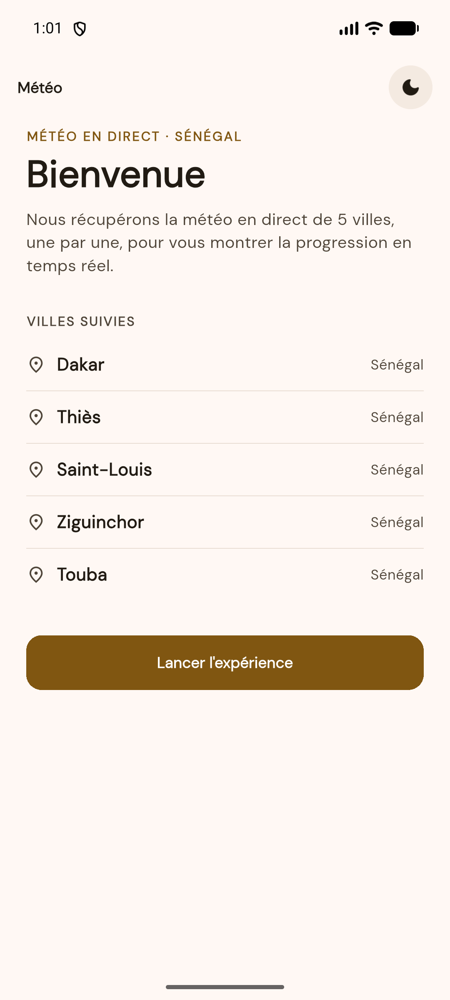
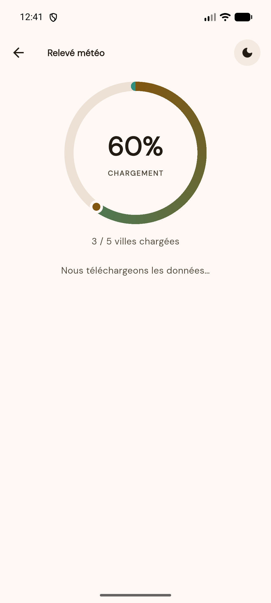
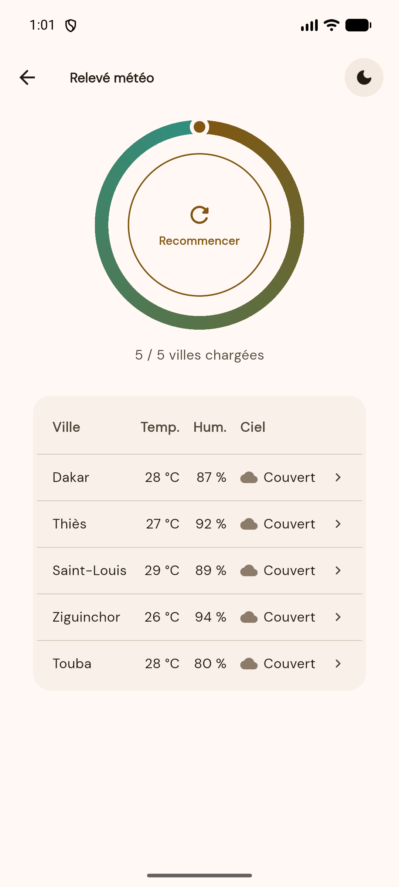
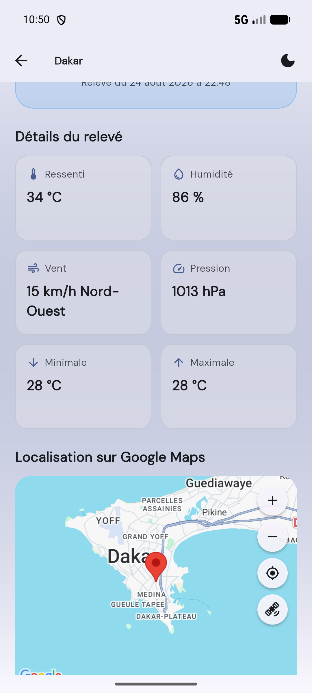
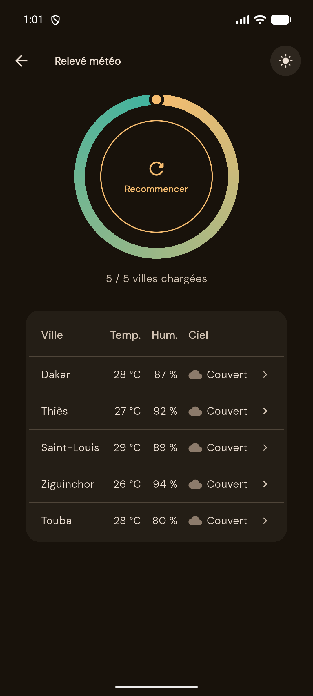
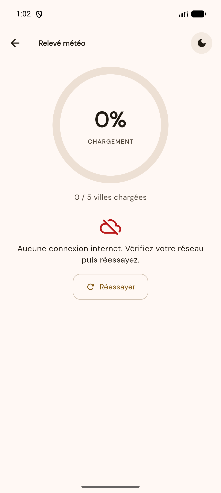

# Météo App — Examen de Développement Mobile

Application Flutter qui relève la météo en temps réel de 5 villes du Sénégal via l'API
OpenWeather, affiche la progression du chargement dans une jauge animée, puis présente
les résultats dans un tableau interactif relié à Google Maps.

**L3 IAGE — ISI — Année 2026**

## Membres du groupe

| Membre | Rôle principal |
| --- | --- |
| **Guelord KANYAMANDA MUMBERE** | Données & réseau : modèles, interface Retrofit, service météo, gestion des erreurs, écran de détail et intégration Google Maps |
| **Aman SOULE** | Interface & animations : thèmes clair/sombre, écran d'accueil, jauge animée, messages d'attente, tableau interactif, navigation |

## Fonctionnalités

- **Écran d'accueil** : message de bienvenue, liste des villes suivies et bouton de lancement.
- **Écran principal** : jauge circulaire animée qui se remplit au fil des appels API (une ville
  toutes les 2 secondes), accompagnée de messages d'attente qui défilent en boucle.
- **Tableau interactif** : dès la jauge remplie, les 5 villes s'affichent avec température,
  humidité et condition du ciel. Chaque ligne est cliquable.
- **Page de détail** : relevé complet (ressenti, min/max, humidité, pression, vent et sa
  direction) et localisation exacte de la ville sur une carte Google Maps, avec des
  commandes de navigation intégrées : zoom avant, zoom arrière, recentrage sur la ville
  et bascule entre vue plan et vue satellite.
- **Gestion des erreurs** : en cas d'échec d'un appel, un message explicite s'affiche avec un
  bouton *Réessayer* qui reprend le chargement là où il s'était arrêté.
- **Mode clair / mode sombre** : bascule disponible depuis n'importe quel écran.
- **Rejouabilité** : une fois pleine, la jauge devient le bouton *Recommencer*. Le bouton retour
  ramène à l'écran d'accueil à tout moment.

## Aperçu

| Accueil | Jauge animée | Tableau interactif |
| :---: | :---: | :---: |
|  |  |  |

| Détail et carte | Mode sombre | Gestion des erreurs |
| :---: | :---: | :---: |
|  |  |  |

## Architecture

```
lib/
├── main.dart                       Point d'entrée, thème et navigation initiale
├── models/
│   ├── ville.dart                  Les 5 villes suivies et leurs coordonnées
│   ├── meteo.dart                  Modèle de la réponse OpenWeather (json_serializable)
│   └── meteo.g.dart                Généré par build_runner
├── services/
│   ├── api_config.dart             Clés et intervalles de l'application
│   ├── meteo_api.dart              Interface Retrofit vers OpenWeather
│   ├── meteo_api.g.dart            Généré par build_runner
│   └── meteo_service.dart          Orchestration des appels et traduction des erreurs
├── screens/
│   ├── accueil_screen.dart         Écran 1 : accueil
│   ├── chargement_screen.dart      Écran 2 : jauge, messages, tableau
│   └── detail_screen.dart          Écran 3 : détail d'une ville + Google Maps
├── widgets/
│   ├── jauge_widget.dart           Jauge circulaire (CustomPainter) et bouton Recommencer
│   ├── message_attente.dart        Messages d'attente en boucle
│   ├── tableau_meteo.dart          Tableau interactif des 5 villes
│   ├── erreur_widget.dart          Message d'erreur et relance de la requête
│   └── bouton_theme.dart           Bascule clair / sombre
└── theme/
    ├── app_theme.dart              Thèmes clair et sombre
    ├── app_dimens.dart             Échelle d'espacement
    └── theme_controller.dart       État du mode d'affichage
```

## Technologies

| Usage | Package |
| --- | --- |
| Appels HTTP typés | `retrofit` + `dio` |
| Sérialisation JSON | `json_serializable` / `json_annotation` |
| Génération de code | `build_runner` |
| Cartographie | `google_maps_flutter` |
| Typographie | `google_fonts` |
| Dates localisées | `intl` |

## Installation

```bash
git clone https://github.com/Guelord11/meteo-app-flutter.git
cd meteo-app-flutter
flutter pub get
dart run build_runner build
flutter run
```

### Clé Google Maps

La carte de l'écran de détail utilise le SDK Google Maps, dont la clé est **restreinte
au nom de package de l'application et à l'empreinte SHA-1 de notre certificat de
signature**. Elle n'est donc pas versionnée : le dépôt ne contient aucun secret.

Conséquence pour qui recompile le projet : la carte s'affichera en gris, car votre
certificat de debug a une empreinte différente de la nôtre. Deux solutions.

**Pour voir l'application telle qu'elle fonctionne** — installez l'APK signé publié
dans l'onglet [Releases](../../releases) du dépôt. Tout y fonctionne, carte comprise.

**Pour recompiler avec votre propre clé** — créez une clé sur
[Google Cloud Console](https://console.cloud.google.com/apis/credentials) avec le
*Maps SDK for Android* activé, puis renseignez-la dans `android/local.properties`
(fichier non versionné) :

```properties
googleMapsApiKey=VOTRE_CLE_ANDROID
```

Pour iOS, renseignez la clé dans `ios/Runner/AppDelegate.swift`.

### Clé OpenWeather

Une clé de démonstration est fournie dans `lib/services/api_config.dart`. Pour utiliser la
vôtre sans modifier le code :

```bash
flutter run --dart-define=OPENWEATHER_API_KEY=VOTRE_CLE
```

## Tests

```bash
flutter test
```

## Répartition du travail

Chaque membre a développé sa partie sur une branche dédiée, poussée depuis son
propre compte GitHub, puis intégrée via une Pull Request relue par l'autre.

| Pull Request | Auteur | Contenu | Relue par |
| --- | --- | --- | --- |
| [#1](../../pull/1) | Guelord KANYAMANDA MUMBERE | Modèles, client Retrofit, service météo, gestion des erreurs, écran de détail, carte Google Maps, configuration Android et iOS | Aman SOULE |
| [#2](../../pull/2) | Aman SOULE | Thèmes clair et sombre, écran d'accueil, jauge animée, messages d'attente, tableau interactif, écran de chargement | Guelord KANYAMANDA MUMBERE |

La relecture de la PR #2 a donné lieu à cinq corrections documentées
(barre système invisible en mode clair, navigation retour, débordement du bouton
« Recommencer », cohérence de l'icône de thème, suppression de code mort).

Le détail complet est consultable via `git log`, l'onglet *Insights → Contributors*
et les discussions des deux Pull Requests.
